# Hardening a Base Ubuntu System

This project involves securing an Ubuntu virtual machine by applying system updates, configuring packages, managing users, and locking down remote access through SSH. Below are the documented steps and tasks performed.

---

## Project Overview

**Title:** Hardening a Base Ubuntu System  

**Objective:** Configure and secure an Ubuntu system by applying updates, configuring SSH, managing users, and securing remote access.

---

## Security Policy Outline Created for Hardening Process

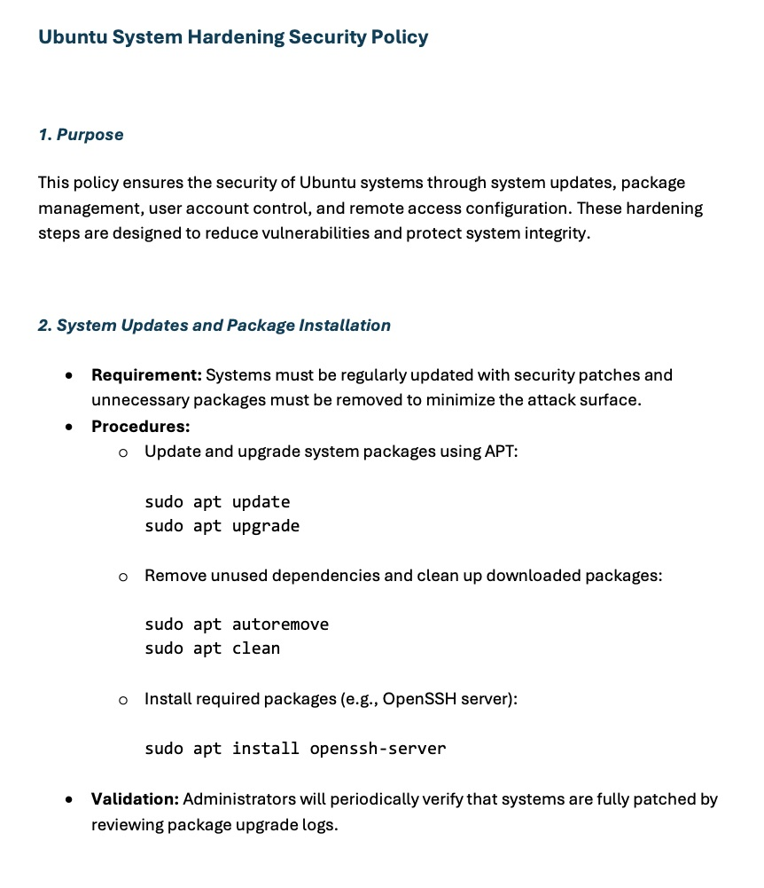

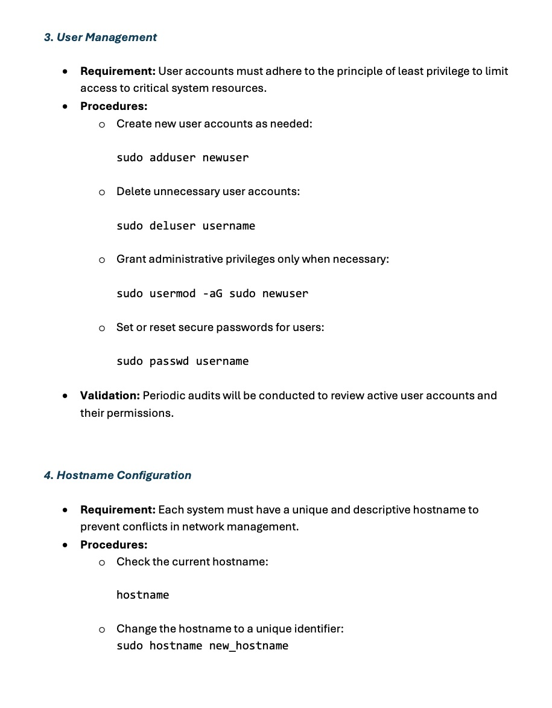

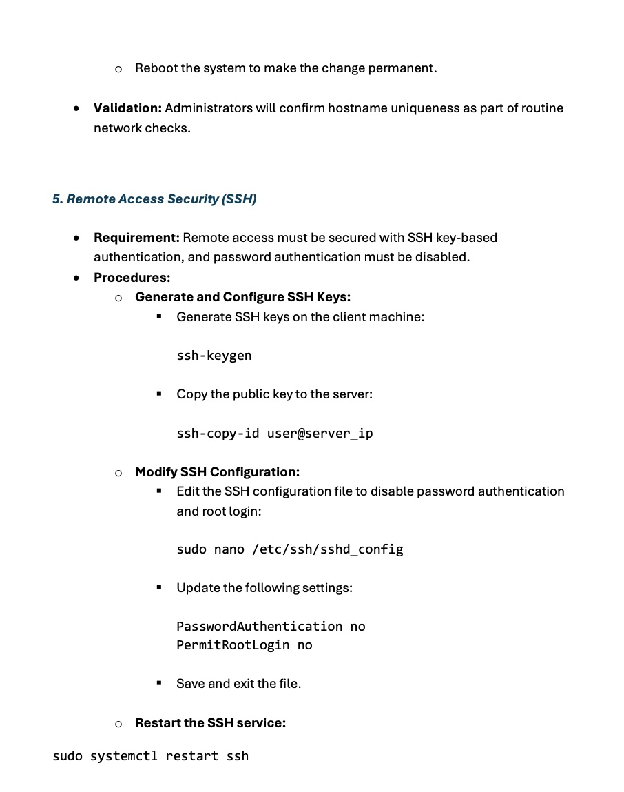

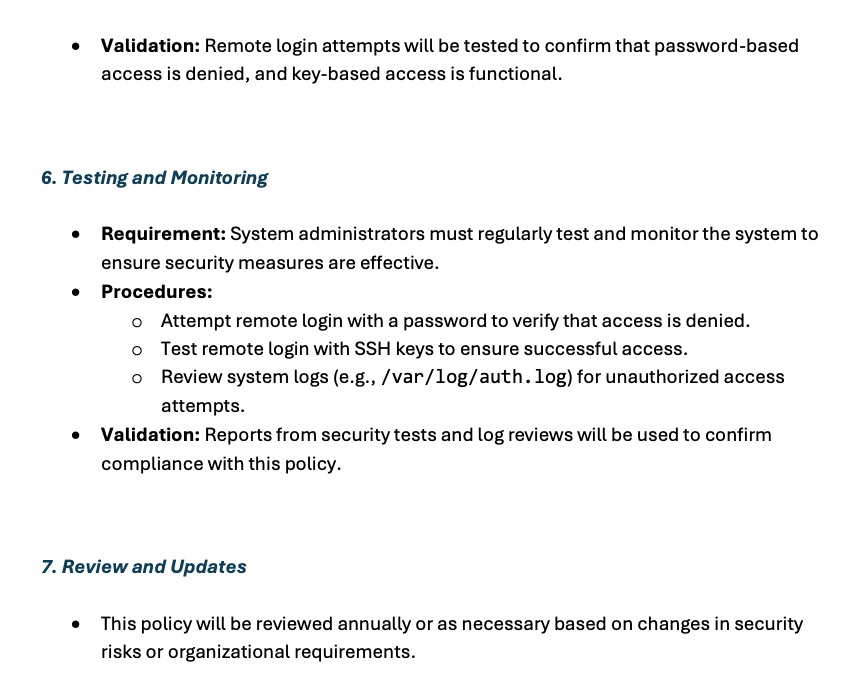

---

## Tools and Technologies

- **Operating System:** Ubuntu 24.04.1 LTS  
- **Package Management:** APT  
- **Security Tools:** OpenSSH
- **Utilities:** SSH, Nano, Systemctl  

---

## System Updates and Package Installation

### Description  
Updated the system and installed necessary packages using APT to enhance security and functionality.

### Commands Used  
```bash
sudo apt update  
sudo apt upgrade  
sudo apt autoremove  
sudo apt clean  
sudo apt install openssh-server
```


### Installed Packages  
- OpenSSH Server for secure remote access.

  
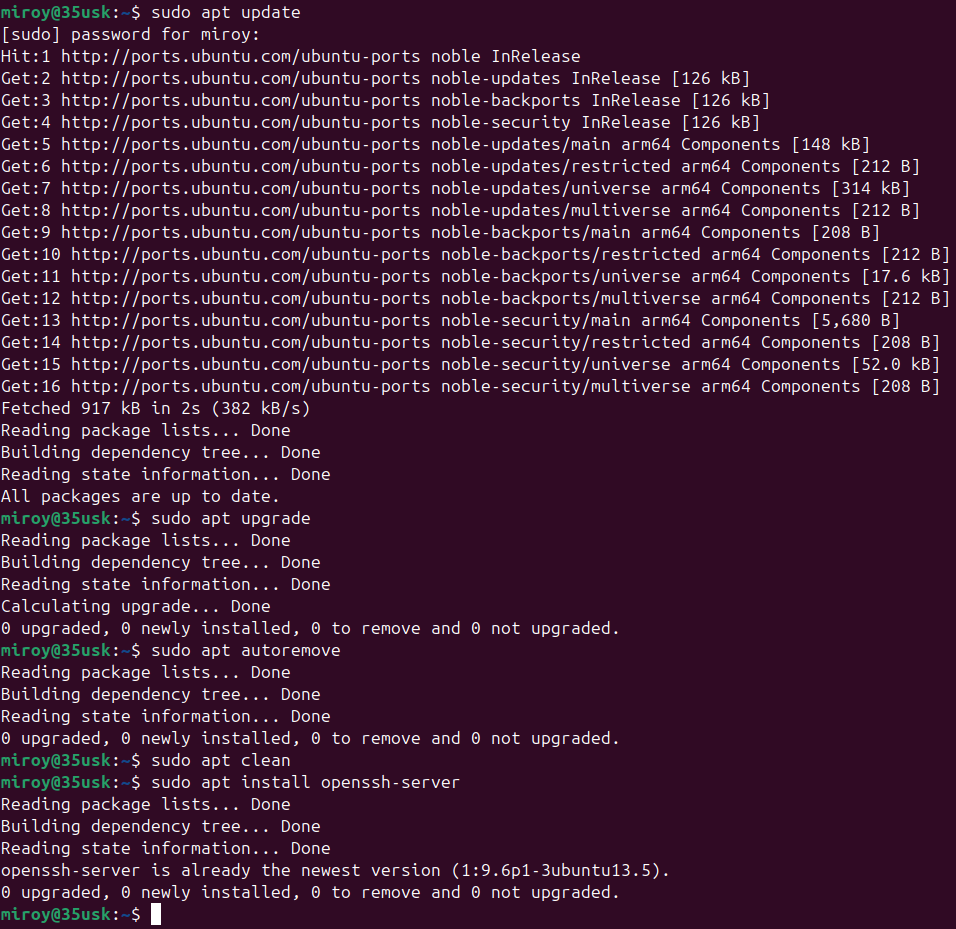

---

## User Management

### Description  
Managed user accounts by adding, and assigning minimal permissions to ensure least privilege.

### Commands Used  
```bash
sudo adduser 
sudo usermod -aG sudo 
sudo passwd 
```
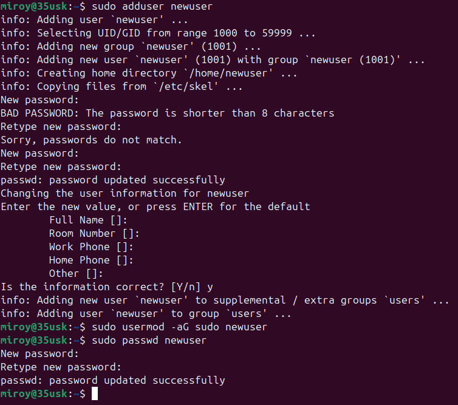

---

## Configuring Hostname

### Description  
Changed the system’s hostname for easier identification.

### Commands Used
```bash
hostname  
sudo hostname  
```
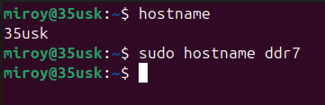

I changed the hostname to ddr7 just because...

---

# Securing Remote Access (SSH)

## Part A: Generate SSH Keys

### Description  
Got IP address, generated and installed SSH keys for secure, passwordless login.

### Commands Used  
```bash
hostname -I
ssh-keygen  
ssh-copy-id ddr7@my_ubuntu_ip
```


I won't post my SSH key for the world to see, so here's a picture of one of my favorite Japanese dogs 😄
   
## Part B: Disable Password Authentication and Root Login

### Description  
Configured SSH to enforce key-based authentication and disabled direct root login.

### Commands Used  
Edited SSH configuration file & restarted SSH
```bash
sudo nano /etc/ssh/sshd_config

PasswordAuthentication no  
PermitRootLogin no

sudo systemctl restart ssh  
```
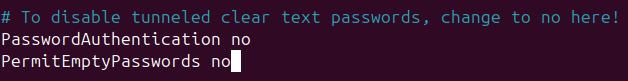

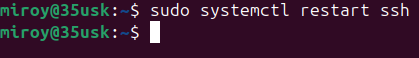

After this point, I started to run into issues. Even after setting `PasswordAuthentication no` in `/etc/ssh/sshd_config`, the server still asked for a password🤔 and the system kept denying access with a `Permission denied (publickey)` error, even after adding a key. and a bunch of other issues as you can see in the screenshot below ⬇️

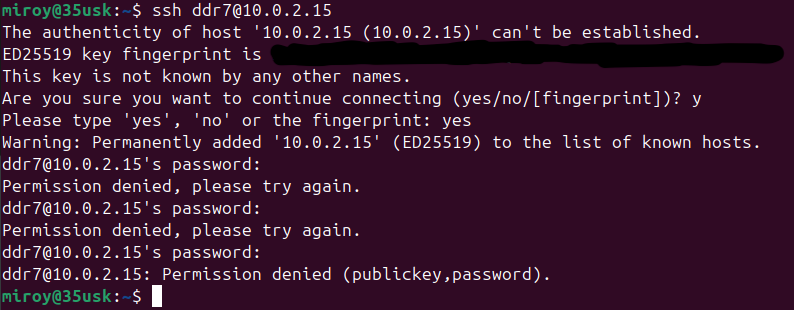

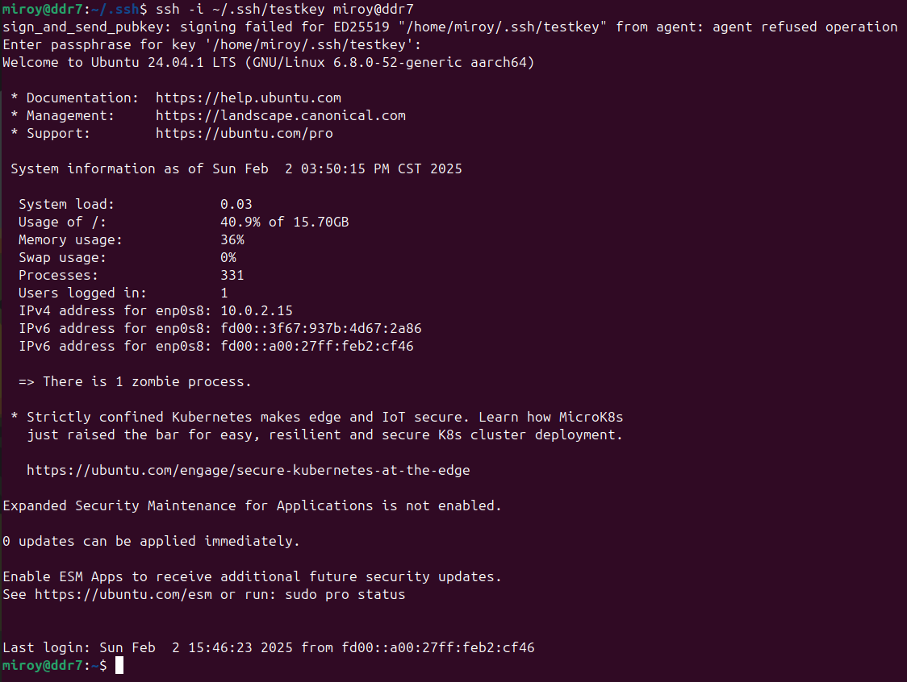

I ended up going to sleep, waking up with a fresh mind and found a solution. (several. lol.) ((everything went wrong))

---

## Testing and Validation

### Description
Verified that password-based login is disabled and SSH key-based login works correctly

- Hardened the Ubuntu system against unauthorized access.
- Implemented SSH key-based authentication to enhance remote access security.

---

## Challenges and Solutions

### Challenge 1: SSH server continued prompting for a password  
**Solution:** Removed deprecated options in `/etc/ssh/sshd_config`, confirmed `PasswordAuthentication no` was set, and restarted the SSH service to apply changes.

### Challenge 2: Public key authentication failed with ‘Permission denied (publickey)’ error 
**Solution:** Verified that the public key was correctly added to `~/.ssh/authorized_keys` on the server. Corrected permissions for `.ssh` and `authorized_keys` (700 and 600 respectively) and ensured ownership was properly set.

### Challenge 3: SSH server unable to load host key
**Solution:** Removed references to deprecated host keys (ssh_host_dsa_key) in `/etc/ssh/sshd_config` and generated missing keys using `ssh-keygen -A`.

### Challenge 4: SSH client failed to authenticate using the key
**Solution:** Generated a new ED25519 key pair, copied the public key to the server with `ssh-copy-id`, and tested authentication using `ssh -vvv` to trace the process.

### Challenge 5: Configuration not applying correctly due to potential file overrides
**Solution:** Checked for additional configuration files in `/etc/ssh/ssh_config.d/` and `/etc/ssh/sshd_config.d/`, ensuring no conflicting settings for `PasswordAuthentication` or `AuthorizedKeysFile`.

---

## Reflection and Future Improvements

### Reflection  
This project deepened my understanding of system hardening, secure remote access, and asymmetric cryptography.

### Future Improvements  
- Automate package updates and user management with shell scripts.
- Create scripts to automate SSH security checks (like weak permissions, configuration best practices).
- Use tools to block repeated failed SSH login attempts.
- Replace public key authentication with SSH certificates to simplify key management.
- Periodically rotate SSH keys and enforce key expiration policies.
- Enable multi-factor authentication (MFA) with security keys.
- Disable weak cryptographic algorithms and enforce modern ciphers.
- Record SSH sessions for audit purposes and integrate with SIEM tools.
- Limit access by configuring IP allow lists in sshd_config.

---

## Conclusion

This project successfully applied system hardening techniques to enhance Ubuntu security by updating packages, managing users, and configuring secure remote access. These measures have minimized the attack surface and vectors, reinforcing the system against unauthorized access.
"""
