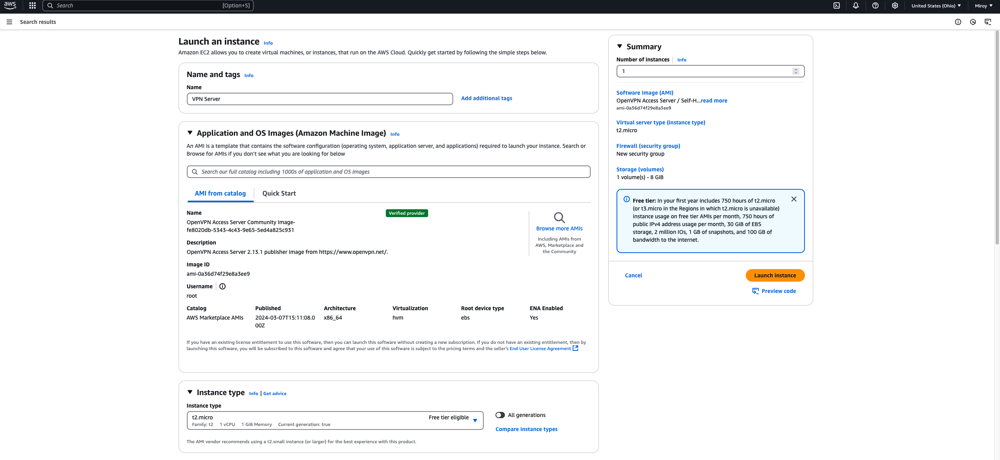

# Deploying a Secure VPN Server on AWS

## Overview
**Title:** Deploying a Secure VPN Server on AWS  
**Objective:** Set up a secure VPN server in AWS to provide encrypted, private access to cloud resources and secure client traffic.

---

## VPN Installation and Configuration

### Description  
Installed and configured OpenVPN Access Server on a AWS EC2 instance.

### Steps  
1. Launch EC2 instance from the AWS Marketplace using the "OpenVPN Access Server" image.
2. Ensure the instance size is **t2.micro** to remain within the free tier.
3. Connect to the instance via SSH using the created private key.

###
Here is a screenshot of the EC2 being created. 

Commands Used  
```bash
cd Downloads/
ssh -i X448.pem openvpnas@<public-ip-address>
sudo passwd openvpn
```

### Installed Packages  
- OpenVPN Access Server for VPN management and encrypted connectivity.

---

## Key Pair Management

### Description  
Created a secure key pair for passwordless authentication and restricted direct root access.

### Commands Used  
```bash
ssh-keygen  
ssh-copy-id -i ~/.ssh/vpn_key.pub ec2-user@<public-ip-address>
```

### Security Enhancements  
- Configured SSH to enforce key-based authentication.
- Disabled direct root login for improved security.

---

## SSH Configuration

### Description  
Edited the SSH configuration to harden remote access.

### Commands Used  
```bash
sudo nano /etc/ssh/sshd_config

PasswordAuthentication no  
PermitRootLogin no

sudo systemctl restart ssh
```

### Issues and Solutions  
- **Issue:** Password-based login was still active.  
  **Solution:** Removed deprecated options in `/etc/ssh/sshd_config` and verified permissions on `.ssh/authorized_keys`.

---

## VPN Server Access and Routing Setup

### Description  
Configured the VPN server for secure traffic routing.

### Steps  
1. Accessed the VPN admin panel at `https://<public-ip>:943/admin`.
2. Logged in using the OpenVPN admin credentials.
3. Enabled full traffic routing through the VPN under **VPN Settings**.
4. Applied and updated server settings.

---

## Client Connection Setup

### Description  
Set up client devices to connect to the VPN server.

### Steps  
1. Navigated to the user portal at `https://<public-ip>:943`.
2. Downloaded and installed the OpenVPN client for the device.
3. Imported the VPN profile and connected using the admin credentials.

---

## Testing and Validation

### Description  
Verified VPN connectivity and security.

### Steps  
1. Tested connection by logging in from a remote device.
2. Checked IP address to confirm traffic was routed through the VPN.

### Commands Used  
```bash
curl ifconfig.me
```

---

## Challenges and Solutions

### Challenge 1: SSH server still prompting for a password  
**Solution:**  
Verified that `PasswordAuthentication` was set to `no` and restarted the SSH service.

### Challenge 2: Public key authentication failed  
**Solution:**  
Checked key permissions (700 for `.ssh`, 600 for `authorized_keys`) and ownership.

### Challenge 3: Configuration files causing conflicts  
**Solution:**  
Reviewed additional configuration files in `/etc/ssh/sshd_config.d/` for overrides.

---

## Reflection and Future Improvements

### Reflection  
This project enhanced my knowledge of AWS, system security, and VPN infrastructure.

### Future Improvements  
- Automate VPN setup using infrastructure-as-code (IaC) tools like Terraform.
- Implement IP allowlists and advanced traffic filtering.
- Enable MFA for additional security.
- Configure monitoring and alerts for VPN server events.

---

## Conclusion

This project successfully deployed and secured a VPN server on AWS, enabling encrypted access to cloud resources and enhancing system security through best practices.
