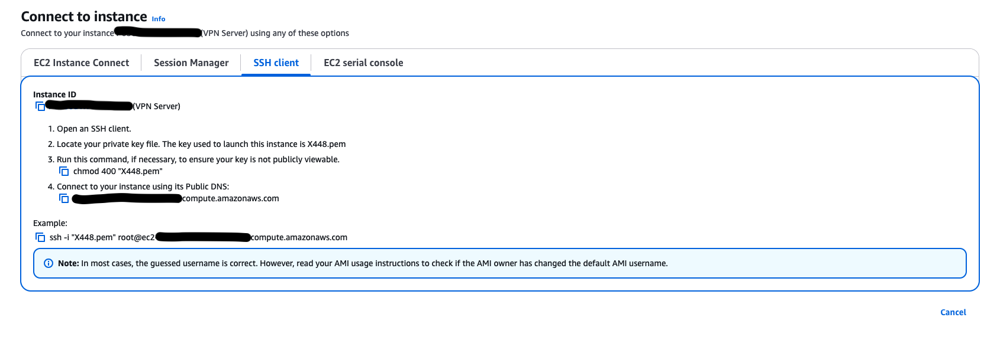
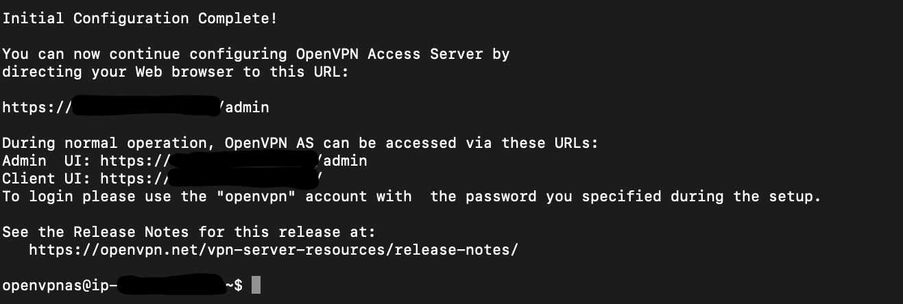
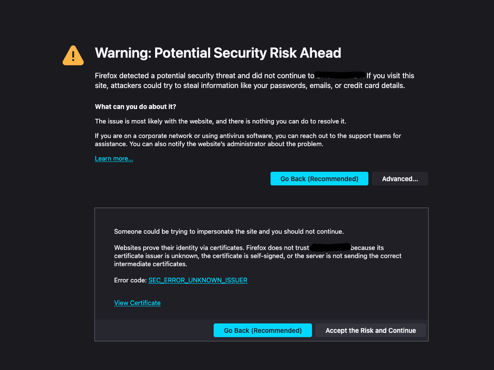
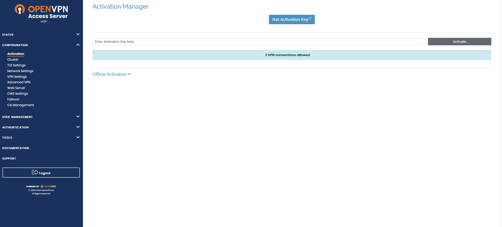
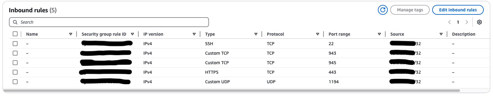
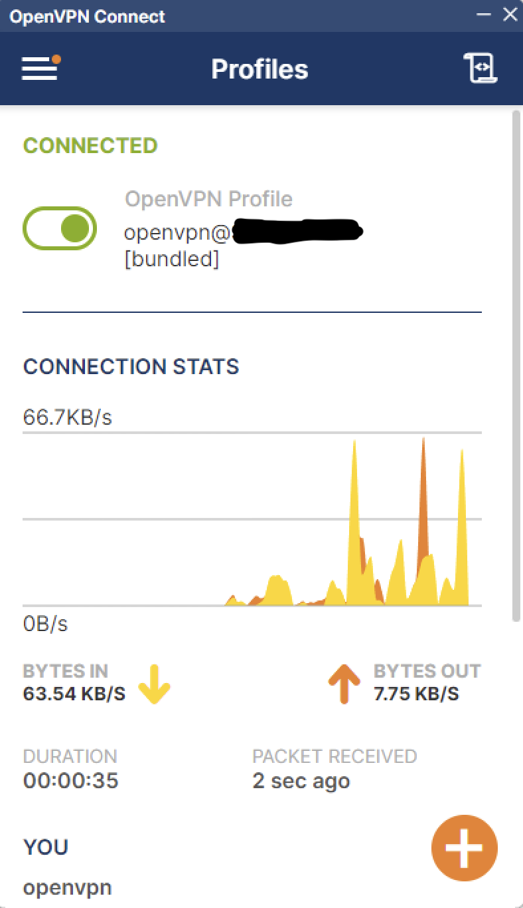

# Deploying a Secure VPN Server on AWS

This project involves setting up and securing a VPN server on AWS by configuring EC2, OpenVPN, and related services. Below are the documented steps and tasks performed.

---

## Project Overview

**Title:** Deploying a Secure VPN Server on AWS  

**Objective:** Set up a secure VPN server in AWS to provide encrypted, private access to cloud resources and secure client traffic.

---

## Tools and Technologies

- **Cloud Provider:** AWS  
- **Operating System:** OpenVPN Access Server on Amazon Linux  
- **Network Configuration:** AWS Security Groups, Elastic IPs  
- **VPN Tools:** OpenVPN Access Server  

---

## Part A: Launch EC2 Instance

### Description  
Launched an EC2 instance using the OpenVPN Access Server image from the AWS Marketplace.




Here is a screenshot of the EC2 instance being created & the SSH information. (Public IP and instance ID are blocked out for security reasons.)

---

## Part B: Connect to the Instance via SSH

### Description  
Connected to the newly created EC2 instance via SSH using the private key.

### Commands Used  
```bash
cd Downloads/
ssh -i X448.pem openvpnas@<public-ip-address>
```



Here is a screenshot of the SSH session connected successfully and the initial configuration completed.

---

## Part C: Configure OpenVPN Admin Password

### Description  
Configured the admin password for the OpenVPN Access Server.

### Commands Used  
```bash
sudo passwd openvpn
```

This step secures the VPN server by enabling password protection for the admin account.

---

## Part D: Configure VPN Routing and Admin Access

### Description  
Accessed the VPN admin panel and configured full traffic routing through the VPN.

- Accessed the VPN admin panel at `https://<public-ip>:943/admin`.
- Logged in using the OpenVPN admin credentials.
- Enabled full traffic routing under **VPN Settings**.
- Applied and updated server settings.



Here is a screenshot showing Firefox warning about a self-signed certificate. (You normally wouldn't proceed unless you are setting up a trusted server.)



Screenshot of the OpenVPN admin panel.

---

## Part E: Configure EC2 Security Groups

### Description  
Configured security groups to restrict access to trusted IP ranges and set up essential ports for OpenVPN and secure remote administration.


### Security Group Rules  
```text
Port     Protocol   Source
22       TCP        <trusted-ip>/32
943      TCP        <trusted-ip>/32
945      TCP        <trusted-ip>/32
443      TCP        <trusted-ip>/32
```

This configuration reduces the risk of unauthorized access by restricting sensitive administrative ports to trusted IP addresses.


Screenshot of the inbound rules.

---

## Part F: Assign Static Elastic IP

### Description  
Assigned a static Elastic IP to the EC2 instance to maintain a consistent IP address across restarts.

- Created an Elastic IP in the EC2 console.
- Associated the Elastic IP with the running EC2 instance.

This step ensures stable client connectivity and prevents IP changes on server restarts.

---

## Part G: Create OpenVPN User Groups and Permissions

### Description  
Created admin and user groups, added accounts, and updated passwords for enhanced security.

- Created an **admin group** and added an administrative account.
- Created a **user group** and added standard VPN user accounts for my two friends to use.
- Changed the passwords for both admin and user accounts.

These changes enhance security by organizing users into groups and enforcing password policies.

---

## Part H: Set Up Client Connection

### Description  
Configured client devices to connect to the VPN server.

- Navigated to the user portal at `https://<public-ip>:943`.
- Downloaded and shared the OpenVPN client with embedded profiles to two friends for testing.

---

## Part I: Test and Validate VPN Setup

### Description  
Tested VPN connectivity and security by logging in & connected from remote devices.

### Steps  
- Logged into the VPN from multiple client devices.
- Checked the external IP address to confirm that traffic was routed through the VPN.


A screenshot one of my friends sent me being connected to the VPN.

---

## Challenges and Solutions

### Challenge 1: AWS charges for outbound traffic despite free tier  
**Solution:** Set up billing alerts in AWS to monitor and notify when outbound traffic usage approaches or exceeds free tier monthly limits.

### Challenge 2: Difficulty understanding AWS billing structure  
**Solution:** Reviewed AWS documentation on EC2 traffic billing, including charges for Elastic IPs and outbound traffic, to clarify pricing and avoid unexpected costs.

### Challenge 3: Monitoring VPN usage and traffic  
**Solution:** Configured CloudWatch alarms to track network traffic (NetworkOut) and billing metrics in real time.

---

## Reflection and Future Improvements

### Reflection  
This project enhanced my understanding of deploying and managing secure infrastructure on AWS, including EC2, VPN setup, billing, traffic management, and user access security.

### Future Improvements  

- Enable multi-factor authentication (MFA) for both users and admin accounts.
- Scale the project to deploy multiple VPN servers across different countries to provide better coverage and redundancy.
- Consider using alternative, more cost-effective cloud services to reduce expenses while maintaining performance and security.
(because <strong>MAN<strong> this can get expensive real quick lol)(I even had to tell my friends not to overuse the VPN to avoid breaking the bank))

---

## Conclusion

This project successfully deployed and secured a VPN server on AWS, enabling encrypted access to cloud resources and enhancing system security through best practices.

---
